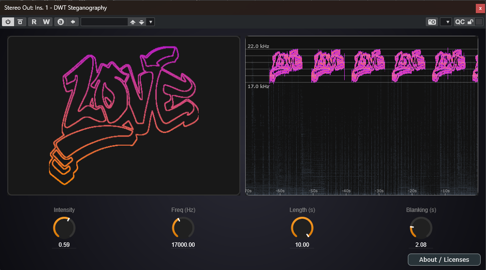

# SIGIL DWT - Premium Audio Steganography



**SIGIL DWT** is a high-end, commercial-grade audio steganography VST3/Standalone plugin built with C++ and JUCE. It allows you to inject visual data (images, typography, logos) directly into the spectral domain of an audio signal, making them visible in any downstream spectrum analyzer (such as FabFilter Pro-Q3).

Designed with a strict mastering philosophy, SIGIL DWT operates within the safe high-frequency band (16 kHz - 22 kHz), prioritizing acoustic transparency over brute-force visual injection, thus preventing phase issues and low-end mud in your mixes.

## 🚀 Key Technologies

### 1. Dual Sobel Filter (Luminance + Alpha)
Unlike naive image converters, SIGIL DWT uses a custom high-precision **Dual Sobel C++ Filter** that operates simultaneously on the Luminance channel and the Alpha channel. This ensures perfect topological extraction of both opaque photographs (JPEGs) and transparent typography/logos (PNGs) without flattening backgrounds or destroying delicate line work.

### 2. Discrete Wavelet Transform (Daubechies 4)
Instead of using standard FFT/IFFT overlap-add methods that can introduce smearing and pre-ringing artifacts, the audio engine utilizes **Daubechies 4 (Db4) Discrete Wavelet Transforms (DWT)**. This allows for precise subband isolation and modulation, enabling surgically clean frequency injection with ultra-fast transient response.

### 3. Neural Network Integration (ONNX Runtime / U2-Net)
The plugin comes with a fully embedded ONNX Runtime environment, evaluating the **U2-Net** salient object detection neural network in a background thread. While currently bypassed for raw topological accuracy via the Sobel filter, the architecture is primed for hybrid AI-driven silhouette masking.

### 4. Lock-Free Concurrency & Direct2D Safe Rendering
To handle heavy real-time ML inference and 60fps Spectrogram rendering without glitching the audio thread, the architecture features a robust lock-free atomic bridge (single-producer/single-consumer double buffering) and deep image cloning (`createCopy()`) to prevent GPU-level deadlocks in Direct2D.

## 🎛️ Mastering-Grade Presets

The plugin offers a specialized preset architecture tailored for professional audio engineers:

- **Stealth Watermark:** Ultra-low intensity and long pacing at 19kHz. Zero added hiss, creating a faint but legally provable watermark for copyright protection.
- **Balanced Print:** The sweet spot at 17kHz. Legible typography acting psychoacoustically as analog high-end "air" or dither.
- **High Definition:** Maximizes visual aesthetics at 16kHz for promotional easter-eggs, at the cost of perceptible high-end hiss.
- **Dense Fill:** Maximum density and rapid pacing for creative sound design transitions over noise synthesizers.

## 🛠️ Build Instructions

This project uses CMake and requires **Visual Studio 2022** on Windows (or equivalent on macOS).
The ONNX Runtime is automatically downloaded via `FetchContent`.

```bash
mkdir build
cd build
cmake ..
cmake --build . --config Release
```

The resulting VST3 plugin can be found in `build/SteganographyPlugin_artefacts/Release/VST3/`.

## 📄 License & Legal

- Code authored for SIGIL DWT is provided under MIT License.
- **ONNX Runtime**: MIT License (Microsoft Corporation).
- **JUCE Framework**: GPLv3 / Commercial License (Raw Material Software).
